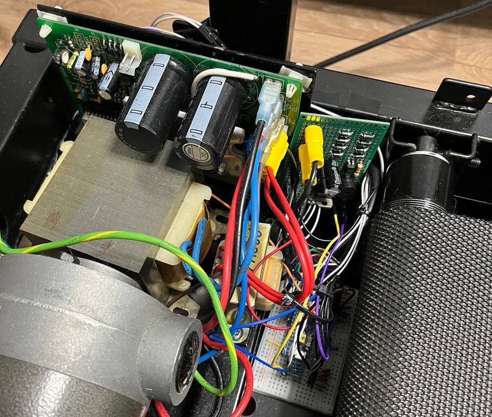

# Description

This project replaces the entire logic/control section of a broken treadmill with a custom-designed **STM32** microcontroller-based control system. The power electronic part of the original board stayed intact, but the control MCU and interface electronics were redesigned to restore full functionality and improve usability. Firmware is written in **C** using **HAL** library and register access when needed.

# Hardware

### Components

- **Power PCB:** Reused robust power part of the original board;
- **Logic PCB:** Designed board that contains low-voltage supply + control logic;
- **Interface PCB:** Contains three buttons, and LCD 16x2;
- **MCU:** STM32 F103C6T6;

### Architecture

System uses phase angle control topology. The original power board contains an optocoupler that triggers a triac driving the 220 VAC power rail. After each zero-cross event, the triac naturally turns off; the moment at which it is fired determines what portion of each AC half-wave reaches the motor.

The logic PCB generates a zero-cross pulse using a transformer (13 VAC), rectifier, and an optocoupler. When the AC waveform rises above the LED threshold (~1.2 V), the optocoupler produces a clean pulse that marks each zero-crossing. STM32 receives this pulse, TIM1 in one pulse slave mode starts counting a delay automatically, and then, in the end of the delay, fires a short trigger pulse to the power-stage optocoupler, which in turn fires the main triac.

Motor speed is closed-loop controlled. The PID controller adjusts delay of TIM1 based on the current speed, calculated via RPM and a belt length. If current speed lower than target, PID decreases TIM1 delay, that gives more power to the triac. And vice versa.

# Software

### Architecture

Almost all software is divided into two layers: driver and application. 

- **Driver layer.** Low level code related to peripheral configuration, peripheral initialization.

- **Application layer.** Code, that's not related or not only related to peripherals. Software that built on top of the drivers, and corresponds to one specific use.

Some modules (such as simple Buttons or Buzzer) are too small to justify a strict driver/application separation. In these cases, the functionality is implemented in a single combined module to keep the code clean and avoid unnecessary fragmentation.

### Main loop

The main loop coordinates the system's high-level tasks: motion control, fault monitoring, button handling**, **buzzer control, and LCD updates:

- **motion.** Executes the PID-based speed control described earlier, updating the phase-angle delay according to the current RPM feedback.
- **fault_check.** Monitors critical runtime conditions. It ensures that tim3, hall sensor and motion control work correctly.
- **buttons_handler.** Polls the user interface buttons (Start/Stop, Speed+, Speed–), debounces input, passes information to the system module.
- **buzzer.** Non-blocking audible feedback system.
- **LCD.** Periodically updates the 16×2 LCD with four metrics: Calories (C), Speed (S), Time (T), and Distance (D). The update routine is optimized to refresh only changed fields.

